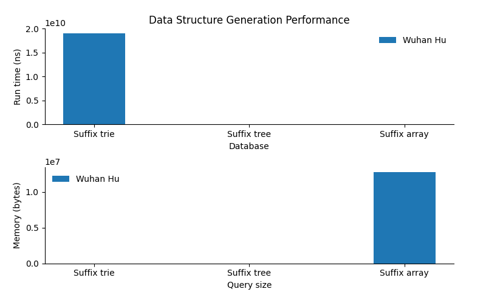
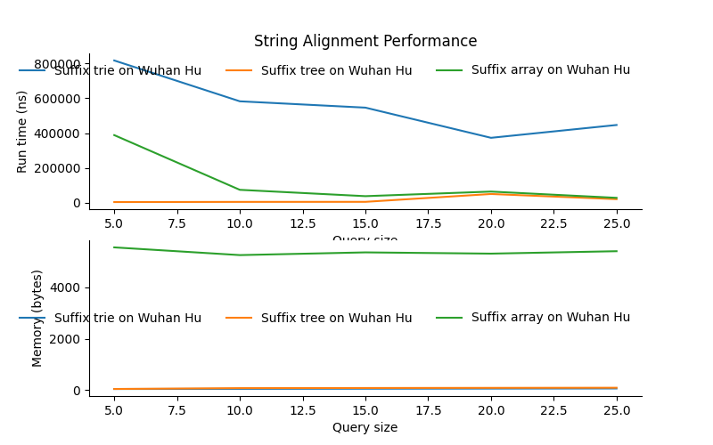

[](https://classroom.github.com/a/2H4hMYgM)
# suffix_index
Suffix data structures for aligning reads to a reference.
 - Suffix tree
 - Suffix trie
 - Suffix array

# Usage
The usages below are provided for the file structure of the repo as given. In your own use cases, adjust paths to the `string_search.py` file to reflect your setup.

## Dependencies
Before using, install dependencies listed in `requirements.txt`
```shell
$ pip install -r requirements.txt
```

## Empirical comparison
```shell
usage: src/evaluation.py [-h] -r REFERENCE [REFERENCE ...] --query_size QUERY_SIZE QUERY_SIZE QUERY_SIZE [--queries_per_size QUERIES_PER_SIZE]
                     [--rounds ROUNDS] --out_file OUT_FILE [--width WIDTH] [--height HEIGHT]

options:
  -h, --help            show this help message and exit
  -r REFERENCE [REFERENCE ...], --reference REFERENCE [REFERENCE ...]
                        Reference sequence files
  --query_size QUERY_SIZE QUERY_SIZE QUERY_SIZE
                        Query size range (start stop step)
  --queries_per_size QUERIES_PER_SIZE
                        Unique queries per size (default: 5)
  --rounds ROUNDS       Number of rounds to run each algorithm (default: 5)
  --out_file OUT_FILE   File to save plot to
  --width WIDTH         Width of plot in inches (default: 8)
  --height HEIGHT       Height of plot in inches (default: 5)
```

## Examples
```shell
$ python src/evaluation.py \
    -r data/wuhana-hu.fa.gz \
    --query_size 5 30 5 \
    --queries_per_size 5 \
    --out_file doc/results/wuhana_q5-30-5_n5.png
READING DATASETS
DATASETS READ
RUNNING EXPERIMENT NOW
————————————
GENERATING QUERYSETS...
TESTING SETUP TIMES
        SETUP FOR Suffix trie ON DATASET 0
                ROUND 0
                        RUN TIME: 18344769734ns MEM USAGE: 5146b
...
SETUP TIMES COMPLETE
TESTING ALIGNMENT TIMES
        QUERYSET FOR Suffix trie
                QUERY 0
                        RUN TIME: 1171624.6ns   MEM USAGES: 47.0b
...
ALIGNMENT TIMES COMPLETE
```
<center></center>
<center></center>